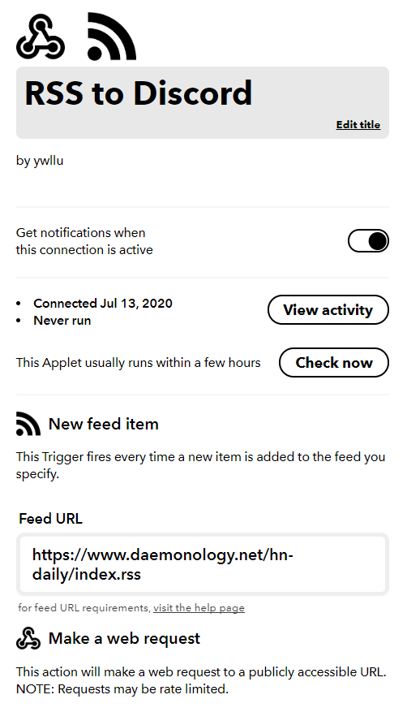
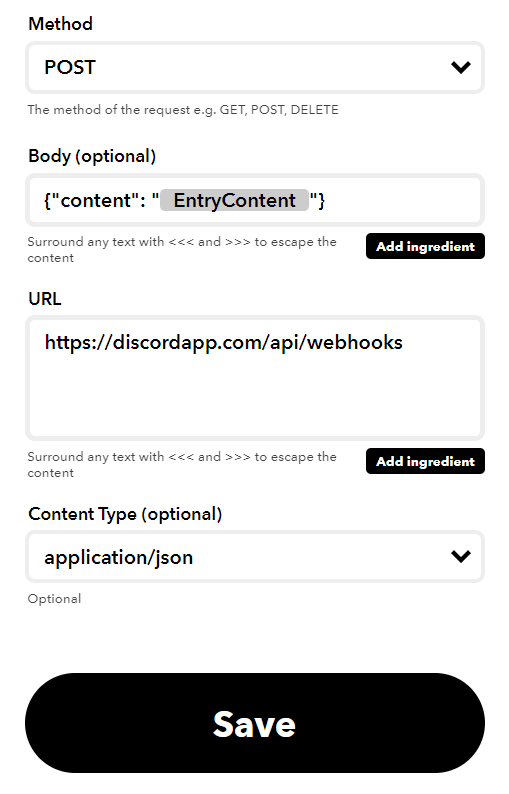

## 在 IFTTT 建立一個 Applet

[Official: What is an Applet?](https://help.ifttt.com/hc/en-us/articles/115010361348-What-is-an-Applet-)

[Official: Login and Create Service](https://ifttt.com/create)

> IF THIS (RSS Feed) THEN THAT (Webhooks)

## 追記

翻了好幾篇文章，調整了好多次，始終得到錯誤訊息  
`Action failure message: Unable to make web request. Your server returned a 400`  
關於這個錯誤訊息 reddit 上也是各種 unsolved thread  
留存做紀錄，日後再來調整