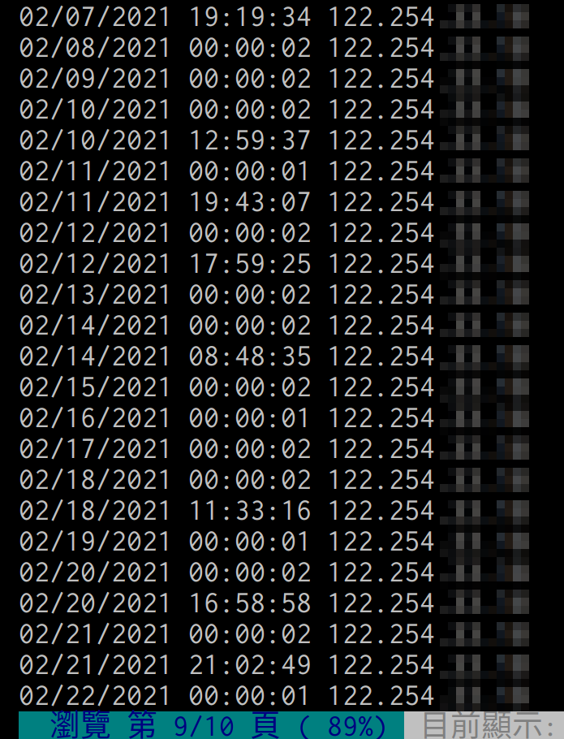

# PTT 每日自動登入

讓排程來幫你每日自動登入PTT吧！  

## 需求
+ cron
+ expect (互動用)

## 腳本

+ [gist連結](https://gist.github.com/uWayLu/c99d1b87cef17117e0feffa29b0f11b1)

```sh
#!/usr/bin/env expect

# Login into PTT via SSH.
# Combine crontab with this script so you don't forget to login PTT everyday.

# Usage: /bin/bash -c ${FILE_PATH_OF_THIS_SCRIPT}

# Example in crontab:
# ptt auto login, every day at 12:00 PM
# 0 12 * * * /bin/bash -c ${ABSOLUTE_FILE_PATH_OF_THIS_SCRIPT}

spawn ssh -oBatchMode=no -oStrictHostKeyChecking=no bbsu@ptt.cc

set BBS_ID [lindex $argv 0]
set BBS_PW [lindex $argv 1]

expect {
      "請輸入代號" { send "$BBS_ID\r" ; exp_continue }
      "請輸入您的密碼" { send "$BBS_PW\r" ; exp_continue }
      "您想刪除其他重複登入的連線嗎" { send "N\r" ; exp_continue }
      "您要刪除以上錯誤嘗試的記錄嗎" { send "N\r" ; exp_continue }
      "密碼不對喔" { exit }
      "裡沒有這個人啦" { exit }
      "請勿頻繁登入以免造成系統過度負荷" { send "\r" ; exp_continue }
      "請按任意鍵繼續" { send "\r" ; exp_continue }
      "oodbye" { exit }
 }

exit
```

## 上站紀錄



## 疑問

1. 帳密寫在排程的安全如何，還會不會有其他地方漏出？
  > crontab -u 需要 sudo  
  > 如果 journal 有 log, 需要 sudo 才能看  
  > 其他地方呢？

## 參考
+ [M157q 的 gist](https://gist.github.com/M157q/ad375e227ec0f1ba450915df65433473)