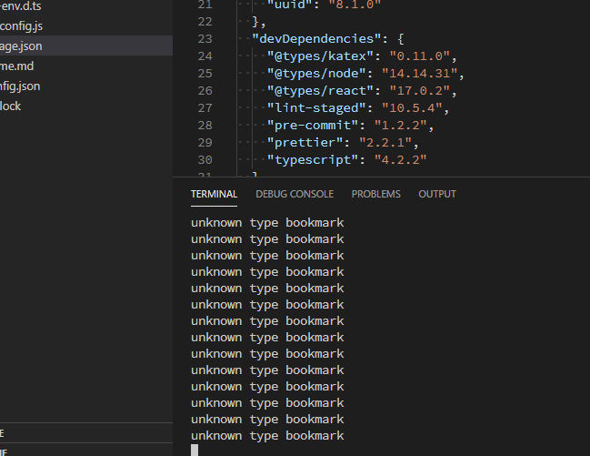

## Notion Blog 是什麼？

[ijjk/notion-blog](https://github.com/ijjk/notion-blog)

> A Next.js site using new SSG support with a Notion backed blog

將你的 Notion 做為文章管理的資料庫，
notion-blog 透過 notion API (private, authed) 取得文章資料，
預渲染成靜態頁面，並部署到 Vercel (Optional)

### 按下 Deploy 後

1. 記得填 `NOTION_TOKEN` 和 `BLOG_INDEX_ID` ，或者 deploy fail
2. 手動建立文章列表吧， `node scripts/create-table.js` 無法正常工作

    [notion-blog Issues](https://github.com/ijjk/notion-blog/issues?q=is:issue+is:open+create-table)

### 本地部署

本地用的 ENV 可以 `touch .env.local` ，不進版控

## 部署 Notion Blog 你或許想知道……

### Vercel / Vercel Inc. / Next.js

開發了 Next.js；最好用的網站託管，甚至可以部署動態網站
~~修仙~~神仙網站

[Next.js - 维基百科，自由的百科全书](https://zh.wikipedia.org/wiki/Next.js)
[vercel是什么神仙网站？](https://zhuanlan.zhihu.com/p/347990778)

### SEO / SSR / SSG

[初探 Server-Side-Rendering 與 Next.js 推坑計畫](https://medium.com/starbugs/%E5%88%9D%E6%8E%A2-server-side-rendering-%E8%88%87-next-js-%E6%8E%A8%E5%9D%91%E8%A8%88%E7%95%AB-d7a9fb48a964)

> Next.js 是什麼？
Next.js 是 React 的 SSR 框架，Vue 也有類似的 SSR 框架叫做 Nuxt，如果要一句話解釋它們為什麼存在，我會說：
因為自己實作 SSR 真的太痛苦了！

### Notion API (beta)

[Notion API - Private beta](https://www.notion.so/api-beta)

## 小結

### 優點

直接將 Notion 做為資料庫。

### 缺點

仍然稚嫩，需要愛，才能折騰。
稚嫩是指沒有生態系，沒有標籤雲樣式等等，有需要？雙手自己來😳。
此外 Notion API 目前仍是 Beta 狀態，仍有變數。

但還是值得期待，讓我們靜靜觀望與守候。

- notion bookmark 不支援

## 其他資料

[juicyfx/vercel-php](https://github.com/juicyfx/vercel-php)