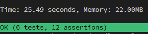

故事是這樣，PHP 寫了四年，  
期間玩過 1 年的 CodeIgniter 3，2 個月的 Laravel 5，  
2 年的 Slim 3 搭配 Laravel 的 Eloquent，但對 Laravel 本身不算熟悉。  

感謝某橘提供的關鍵字 **Realworld。**

## Realworld 是什麼？

[gothinkster/realworld](http://realworld.io/)

> "The mother of all demo apps" — Exemplary fullstack [Medium.com](http://medium.com/) clone powered by React, Angular, Node, Django, and many more 🏅

你可以在這裡找到各種語言或框架在實際開發時，可能會遇到的應用範例。

## 那麼要怎麼開始呢

開發環境我選擇 `laradock` ，理由是 docker 的易配置，且工作時已經熟悉，  
並把焦點放在 laravel-realworld-example-app 本身上。

[gothinkster/laravel-realworld-example-app](https://github.com/gothinkster/laravel-realworld-example-app)

跟著 [README.m](http://readme.md)d 手把手，docker 環境相關部分的另外紀錄。

- 移除 `composer.lock` 再做 `composer install`

    原本的 composer.lock 內容會因為相依套件的版本問題，  
    而無法正常安裝；開發環境我們不 care composer.lock

- `~~php artisan serve~~` and You can now access the server at [http://localhost:8000](http://localhost:8000/)

    環境配置是在容器中，由 nginx 做 Web Server，  
    配置域名設定檔到 `laravel.realworld.conf`  
    將域名 `laravel.realworld.test` 加到本機 hosts

    如果系統有裝 php，也可以在外面玩 `php artisan serve`  
    想在容器中跑的話，要另外 expose port，見以下

- 或可以使用專案中直接提供的 docker 配置，`./docker`

## 接下來讀 Code 吧，範例中……

### 實作 API Tests

可以看到，laravel 中也是使用 phpunit 來做測試

- `phpunit tests/Feature/Api/UserTest.php`

    得到以下錯誤

    ```bash
    Caused by
    PDOException: SQLSTATE[HY000] [1044] Access denied for user 'default'@'%' to database 'realworld_test'
    ```

    可以看見 phpunit.xml 中配置了 phpunit 測試時需要的環境變數

    手動建立對應測試用 Database

    ```sql
    # 進到容器中 mysql
    CREATE DATABASE 'realworld_test';
    GRANT ALL PRIVILEGERS ON realworld_test.* TO 'default'@'%';
    FLUSH PRIVILEGES;
    ```

    現在可以成功連接測試資料庫了，換成其他錯誤

    ```bash
    Caused by
    ErrorException: Using integers for registered date claims is deprecated, please use DateTimeImmutable objects instead.
    ```

    手動降 lcobucci/jwt 版本可解

    ```bash
    composer require lcobucci/jwt:3.3.3
    ```

      
    到這邊 pass

- api 的 http test 實作？看 `UserTest.it_returns_the_current_user_when_logged_in()`

    [Testing](https://laravel.tw/docs/5.2/testing)

    Illuminate\Foundation\Testing\Concerns 中的 MakesHttpRequests trait，  
    提供了模擬 http 請求與回應，測試方法則斷言回應內容。

    Testcase 使用 DatabaseMigrations trait，  
    在每次測試執行前後分別自動執行 migrate:fresh 與 migrate:rollback，  
    產生臨時的測試資料庫。

- 其他的測試案例大同小異；jsonBody的部分，一樣只斷言驗證是否為 json  
    要驗證 json property required 和 type, 可用 justinrainbow/json-schema

### Migrate/Seed 與 phinx 的異同

```bash
php artisan list migrate
# outputs
Available commands for the "migrate" namespace:
  migrate:fresh     Drop all tables and re-run all migrations
  migrate:install   Create the migration repository
  migrate:refresh   Reset and re-run all migrations
  migrate:reset     Rollback all database migrations
  migrate:rollback  Rollback the last database migration
  migrate:status    Show the status of each migration

php artisan help migrate
# outputs
Usage:
  migrate [options]

Options:
      --database[=DATABASE]  The database connection to use.
      --force                Force the operation to run when in production.
      --path[=PATH]          The path of migrations files to be executed.
      --pretend              Dump the SQL queries that would be run.
      --seed                 Indicates if the seed task should be re-run.
      --step                 Force the migrations to be run so they can be rolled back individually.
  -h, --help                 Display this help message
  -q, --quiet                Do not output any message
  -V, --version              Display this application version
      --ansi                 Force ANSI output
      --no-ansi              Disable ANSI output
  -n, --no-interaction       Do not ask any interactive question
      --env[=ENV]            The environment the command should run under
  -v|vv|vvv, --verbose       Increase the verbosity of messages: 1 for normal output, 2 for more verbose output and 3 for debug

Help:
  Run the database migrations
```

都有提供 migrate 跟 seed，細節使用時再搭配文件；  
laravel artisan 另外提供了 `refresh`, `fresh`, `reset` 操作；  
phinx 有提供 Dry-Run 功能 `$command —dry-run | -x`  

[Database: Migrations](https://laravel.tw/docs/5.2/migrations)  
[Database: Seeding](https://laravel.tw/docs/5.2/seeding)  
[Commands - 0.12](https://book.cakephp.org/phinx/0/en/commands.html#the-migrate-command)

### App Config

- Laravel 中的 configuration 有預設值，在 `config/*.php` 中，
部分可以透過 `.env` 變更
- 標記：沒概念的 `services.php`

### 相依 laravel-cors 如何處理 CORS

- 注意 `config/cors.php`

### Database

- `database/factories/ModelFactory.php`

    [Database Testing](https://laravel.com/docs/5.5/database-testing)

    > **Writing Factories**
    When testing, you may need to insert a few records into your database before executing your test. Instead of manually specifying the value of each column when you create this test data, Laravel allows you to define a default set of attributes for each of your Eloquent models using model factories. ...

### Routes

- 標記：沒概念的 `channels.php`

### App

- **Service Provider?**

    Laravel 實作 DI 的方式

    [Laravel如何實現依賴性注入？](https://medium.com/mr-efacani-teatime/laravel%E5%A6%82%E4%BD%95%E5%AF%A6%E7%8F%BE%E4%BE%9D%E8%B3%B4%E6%80%A7%E6%B3%A8%E5%85%A5-d760c8e5abde)

    > Laravel藉由Service Container與Service Provider實現了依賴性注入，達到低耦合、易擴展的特性。理解何時使用Service Provider，有助於我們實作良好的系統，這也是這份筆記希望研討的主要議題。  
    先講結論--Service Provider適合使用在以下時機：  
     1.希望實踐依賴介面而不是類別的注入時。  
     2.希望建立全域(global)的依賴實例時。  
     3.希望根據狀況，回傳不同的依賴實例時。  

    Slim3 中則是以 `$container['MySerivce']`手動注入到 container，  
    同質 Service 是否依賴介面，由開發者自行決定與實作，  
    是否使用單例模式開發者也需自行處理  

    不管是哪個框架，無論變數還是實例，都應該思考**全域**的必要性

### Realworld

- Model implements Contracts

    [Contracts](https://laravel.tw/docs/5.3/contracts)

- Controllers `extends ApiController`

    熟悉的味道；這邊我先前的習慣是會將 ApiController 定為抽象類別，  
    是為了擴充性而保留？或只是習慣問題。

## 延伸閱讀

core packages; 相依套件；....

### Symfony

下回分曉！
