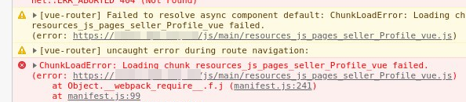
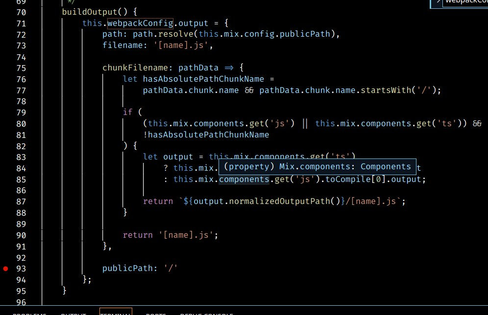

## 環境

- Laravel 7
- Laravel-Mix 6
- webpack 5

## 問題描述

Laravel 專案使用 laravel-mix ，
專案根目錄在 webserver 下並非指到 `/path/to/project/public` ，
而是 `/path/to/project/` ，最後前端 SPA 加載 chunk 失敗



## 想到的幾種解法與嘗試

勾選為嘗試過，刪除線非正解

- [x]  ~~不做 extract~~
    > 即使不做 extract，vue 組件依然是編譯成各自獨立的 .js 由 vue-router 做動態載入

- [x]  vue-router 設定 base
    > 這個要設定，但不是同一個 issue

- [x]  追原始碼，`manifest.js` 可以看到 webpack 的加載路徑錯誤
- [x]  翻 laravel-mix 文件， `setPublicPath()`

    > 然後你會看到這個
    [https://github.com/laravel-mix/laravel-mix/issues/2755](https://github.com/laravel-mix/laravel-mix/issues/2755)

    > Also having the issue while using setPublicPath, this happens in development and production.
    > Chunks are loaded from the root of my app. Any workaround?

    其他相同的 issue 也被 bot 定時關閉了呢 🤨

    沒有用，讓我們來看看 `laravel-mix` 原始碼  
    [https://github.com/laravel-mix/laravel-mix/blob/master/src/builder/WebpackConfig.js](https://github.com/laravel-mix/laravel-mix/blob/master/src/builder/WebpackConfig.js)

    可以看到 `builder/WebpackConfig.js` 中的 `buildOutput` 方法，  
    `publicPath: '/` 無情定義你的 webpack 加載路徑

    

- [x]  那麼我想辦法讓 webpack 動態加載路徑能吃到自定義就行了吧？

    > 夢想很美滿，現實很骨感？  
    webpack 4 的有一籮筐  
    webpack 5 能用的插件僅有一款；還好還有一款  

    [GitHub - note520/webpack-bundle-public-path-plugin: 支持webpack5 动态改变webpack异步请求代码块（chunk请求前缀）publicPath 路径](https://github.com/note520/webpack-bundle-public-path-plugin)

- [x]  看了原始碼，短短的原始碼但完全符合想法與需求

    

    1. 就是要在 webpack 中的作用域能夠覆寫 `__webpack_require__.p`
    2. 就是要能通過 `window.config` 來動態 init entry

## 連環雷？Murmur

這整個事件的起因是

1. testing, development, production 的 entry 不同

    我個人 `testing` 直接 nginx 指到專案 public 目錄，i.e. `https://測試網址/`  
    其他人 testing 則是指到專案目錄，i.e. `https://測試網址/public`  
    dev 環境則是 `http://測試IP/path/to/專案/public`  

    但這不能算 `laravel` 的 bug  
    `laravel` 官方文件一開始就講明  
    site root 應該指到 `laravel_project/public`  
    就測試/開發環境的不同，才會踩到雷  

    我想其他夥伴開發時需要指到 public 可能有其他需求，  
    算了入境隨俗，路徑上能處理還是彈性點處理掉吧

2. Webpack Dynamic Public Path Plugin，都是支援 Webpack 4 的  
   其中有使用到 Webpack 5 棄用的 api，所以裝完在 build 時，就會無情地溫馨報錯

3. 這應該不算但是工作量 +1，XD

   對接 API 時的路徑，原先想說大部分 API 只會在對應的 vue 組件中被調用，就偷懶  
   結果跟路徑雷一起小踩了，最後還是把 API 的部份獨立拆到 `api.js` 中做管理  

   怎麼拆？我是這個效仿這個方式  
   [使用Axios時你的API都怎麼管理？](https://medium.com/i-am-mike/%E4%BD%BF%E7%94%A8axios%E6%99%82%E4%BD%A0%E7%9A%84api%E9%83%BD%E6%80%8E%E9%BA%BC%E7%AE%A1%E7%90%86-557d88365619)

## 腦霧戰士回憶錄

```jsx
// global
window.g_config = {
	publicPath: "{{ Request::root() }}/"
}

// vue-router
let spaPath = '/'

if (window.g_config && window.g_config.publicPath) {
    const appUrl = new URL(window.g_config.publicPath)
    spaPath = appUrl.pathname
}

const router = new VueRouter({
    mode: "history",
    base: spaPath,
```

## 參考資料與延伸閱讀

+ [公共路径 | webpack 中文文档](https://webpack.docschina.org/guides/public-path/)
+ [API 参考 | Vue Router](https://router.vuejs.org/zh/api/#base)
+ [How can use laravel assets in vue component](https://stackoverflow.com/questions/52576512/how-can-use-laravel-assets-in-vue-component)
+ [Laravel + Vue 前后台分开打包解决方案](https://learnku.com/articles/9218/laravel-vue-backstage-package-solution?order_by=created_at&)
+ [從 laravel-mix 0.8 升級到 1.4 版的記錄與坑 | Peng Jie's Blog](https://jiepeng.me/2017/08/07/upldate-laravel-mix-from-0-x-1-x)